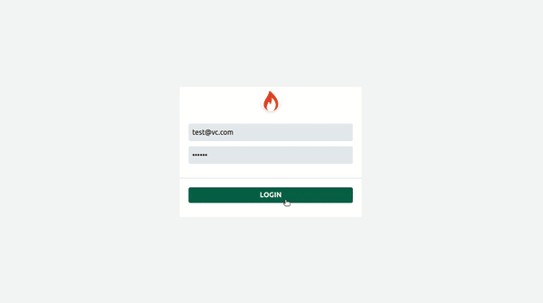

# Virtual Card


Deployed app: [https://startup-reads.netlify.app/](https://startup-reads.netlify.app/)    
    
## Test Login Details

#### Password : 123456

#### Email id : test@vc.com, test2@vc.com, test3@vc.com, test4@vc.com, test5@vc.com
---
### Features:
1. Infinite Scrolling
2. Search By Name and Filter
3. Product page for each product
4. Responsiveness

-----
### Libraries used: 
- **React.js** : v17.0.2
- **React router**: v6.0.0-beta.0
- **Axios** : v0.21.1
- **Tailwind** :v2.1.2


Icons: Font Awesome [font icons](https://fontawesome.com/)   
Bootstrapped with `create-react-app`

---
#### Get started

1. **Clone the repo:**
```bash
  $ git clone https://github.com/Madhusudan707/virtual_card.git
```
1. **Change the Directory:**
```bash
  $ cd virtual_card
```
3. **Install required node modules:**
```bash
  $ npm install
```
4. **Start the dev server:**
```bash
  $ npm start
```
Open the `localhost` link in the browser.
Happy hacking!       


## App Demo     



